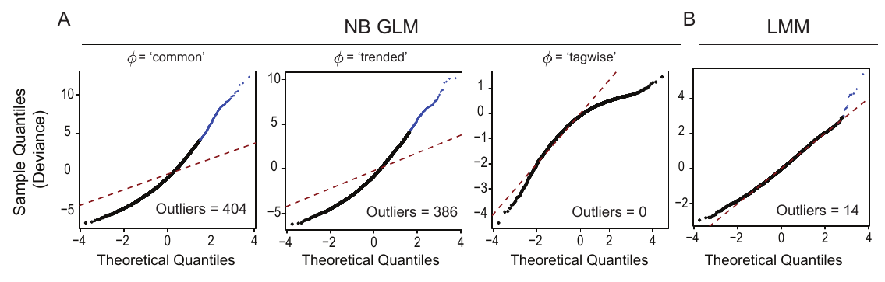

# goodness-of-fit

Most analysis tools for proteomics data have been borrowed directly from
packages designed explicitly for transcriptomics or RNA-seq data analysis: these
approaches may make assumptions that may not hold for proteomics data and should
be carefully considered.

For example, the edgeR package fits the data with a generalized linear model
which assumes that the data are well described by a negative binomal model:
these may be appropriate RNA sequencing-based cound data, but not for proteomics
data. The underlying reason for difference in statistical nature of the data may
stem from the difference in RNA and protein abundance in the cell.

> ### edgeR Goodness of Fit for TMT Protein MS
> #### Goodness-of-fit of the edgeR model for TMT proteomics data. 
> 
> The overall adequacy of edgeR's NB GLM for TMT data were assessed by plotting
> the residual deviance for all proteins as a quantile-quantile plot
> (McCarthy2012). (A) Normalized protein-level data were fit with a NB GLM of the
> form:   
> `log2(Intensity) ~ Mixture + Condition`.
> 
> Where Mixture is an additive blocking factor that accounts for variability
> between TMT mixtures.  The NB framework used by `edgeR` utilizes a dispersion
> parameter, psi, to model mean-variance relationships in the data in three
> different ways: 'common', 'trended', and 'tagwise'.  I plot the deviance
> statistics for the data fit with each of the three dispersion parameters against
> their theoretical normal quantiles using the `edgeR::gof` function. __(B)__ The
> normalized protein-level data were fit with a linear mixed-effects model using
> `lme4::lmer` (Bates2014):  
> `log2(Intensity) ~ 1 + Condition + (1|Mixture)`. 	  
> 
> Where Mixture represents the mixed-effect of `Mixture`. The residual deviance
> and degrees of freedom were extracted from the fitted models, z-score
> normalized, and plotted as in __(A)__. Proteins with a significantly poor fit are
> indicated as outliers in blue (Holm-adjusted P-value < 0.05).
